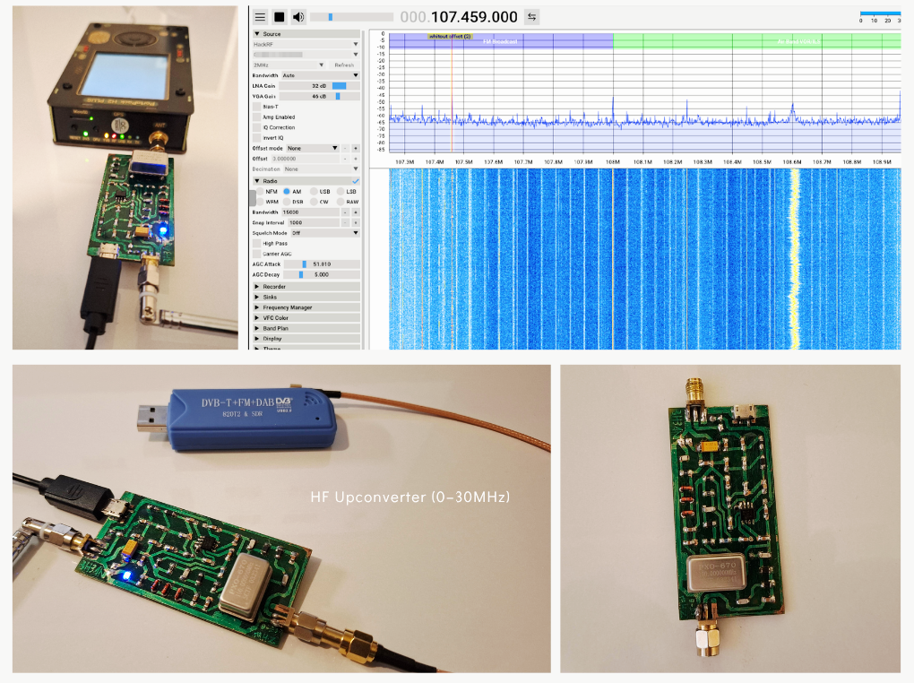

# Compact RF Upconverter (0–30 MHz)

## Overview

This project is a compact redesign of the RF Upconverter originally published by MekWeb.

The circuit is intended to extend the HF reception capabilities of SDR receivers by translating signals in the 0–30 MHz range into a frequency range that can be received by common SDR hardware such as RTL-SDR and HackRF One.

Compared to the original design, the hardware was redesigned as a compact SMD implementation and adapted for direct USB power operation.

---

## How It Works

The converter is built around the NE602A mixer/oscillator IC.

A crystal-controlled local oscillator operating near 100 MHz is mixed with incoming HF signals, producing translated frequency components approximately 100 MHz above the original signal.

Examples:

* 7 MHz → ~107 MHz
* 14 MHz → ~114 MHz
* 21 MHz → ~121 MHz

This allows HF signals to be received using SDR receivers that do not provide optimal direct HF reception.

---

## Design Changes

The original architecture was preserved while several practical modifications were introduced:

* USB-powered operation (5V input)
* Full SMD implementation
* Compact PCB redesign
* Optimized component placement for manual assembly
* SDR-based validation using real RF signals

---

## PCB Notes

The PCB was redesigned as a compact prototype suitable for home-lab assembly.

To simplify soldering and debugging during the prototyping stage, the ground polygon was intentionally reduced.

For production-oriented revisions, a continuous ground plane is recommended to further improve RF performance, shielding effectiveness, and noise immunity.

---

## Power Supply Considerations

RF performance is noticeably affected by power quality.

During testing, battery-powered sources and high-quality power banks produced cleaner results than typical laptop USB ports, which may introduce switching noise and ground contamination into sensitive RF stages.

---

## Validation

The converter was tested using:

* HackRF One
* RTL-SDR

Frequency translation was verified through SDR spectrum analysis and practical signal reception tests.

---

## Repository Contents

* `docs/` – schematic and documentation
* `hardware/` – Gerber manufacturing files
* `images/` – PCB renders, assembled hardware, and SDR screenshots

---

## Reference

Original RF Upconverter design by MekWeb:

https://mekweb.eu/?lang=en&q=download-details&f=77

---

## Notes

This project was built as part of an ongoing interest in RF systems, SDR platforms, signal analysis, and hardware-level experimentation.
